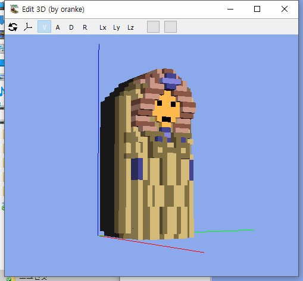

# VXLSE_III_mod

[VXLSE III 1.38](https://www.ppmsite.com/?go=vxlseinfo) 버전을 기반으로 복셀단위 편집, 메시 최적화, OBJ출력 등 제 입맛에 맞도록 수정하고 있습니다.

View->Display 3D Edit Window 메뉴를 눌러보세요.

https://github.com/mikolalysenko/mikolalysenko.github.com/blob/master/MinecraftMeshes2/js 에서 참고한 monotone.js, greedy.js 를 사용해 메시를 최적화 합니다.

그 외 이런저런 수정사항이 있으니 커밋 로그를 살펴보세요.

아직은 UI도 정리되지 않았고, 만든지 오래되어 기능도 가물가물 합니다. 게다가 1.4X 버전이 나오면서 OBJ출력도 빛을 바랬구요. 하지만 간단한 도트를 찍을 때 그림판을 쓰는 것 처럼, 간단한 복셀을 찍을 때 마음대로 다룰 수 있는 자료구조가 있다면 좋을 듯 해서 지금도 즐겁게 이런 저런 구상을 하고 있습니다.
